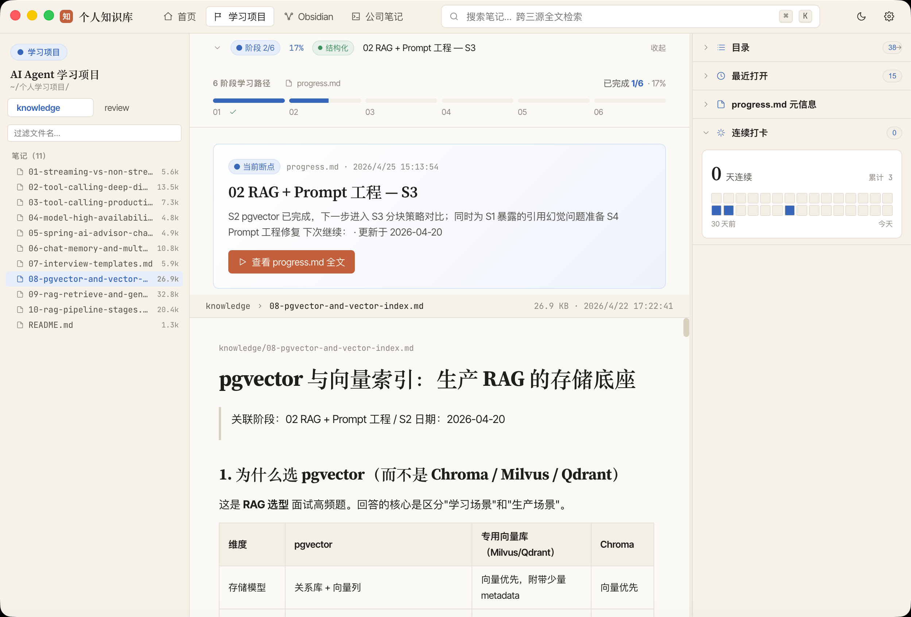
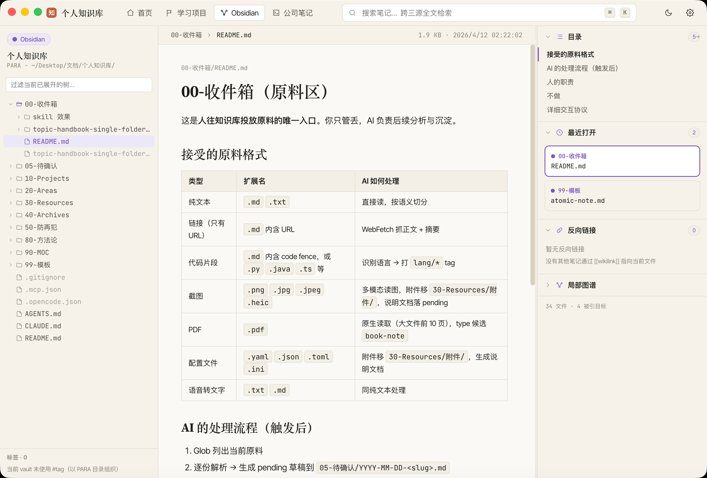
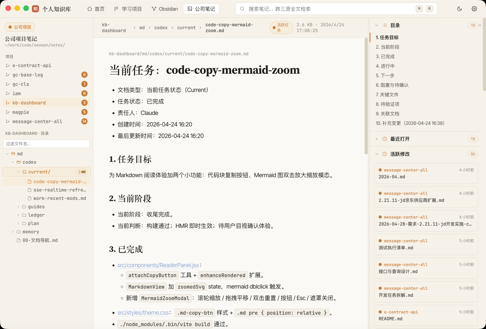

# kb-dashboard · 个人知识库看板

本地 Markdown 三源聚合看板：**学习项目** / **Obsidian 知识库** / **公司项目笔记**。Electron 包装成桌面 App。


> 暖米白底 + Claude 风衬线标题，三源各持一色（蓝 / 紫 / 橙），800+ md 跨源全文搜索 ⌘K。

## 特性

- **三源聚合浏览**：学习项目 / Obsidian vault / 公司笔记各自保留视觉语言（蓝 / 紫 / 橙）
- **跨源浮层搜索**：⌘K 呼出，minisearch 索引 ~800 篇 md，中英混合分词，结果点击直接跳文件
- **Obsidian 专项**：反向链接面板 + 标签统计 + 局部图谱（入链/出链径向布局）
- **学习状态一眼看到**：解析 `progress.md` 头部表格 + 当前断点 + 打卡串联（streak + 30 天热图）
- **公司项目活跃任务**：扫所有 `<project>/md/codex/current/*.md` 聚合到右栏
- **Markdown 阅读增强**：代码高亮（`highlight.js`）+ Mermaid 懒加载 + 图片嵌入（`![[image.png]]`）+ 右侧 TOC（滚动高亮）
- **文件热更新**：chokidar 监听三源 → SSE 推送，改了 md 无需手动刷新
- **受控删除**：右键文件或目录可移到 macOS 系统废纸篓，不做永久删除
- **深色主题**：light / dark / system 三档，跟随系统配色切换
- **智能链接跳转**：5 档识别（http/锚点/绝对源路径/相对 md/镜像仓库路径）
- **Electron 打包**：单进程内置 Fastify + `asar + asarUnpack`，产出 `.app` 可直接启动

## 界面预览

### 学习项目 · 阶段进度 + 当前断点 + 打卡热图



左栏 `knowledge` / `review` 切换 + 文件名过滤；中栏顶部 6 阶段进度条 + 当前断点折叠卡（`localStorage` 记忆开合）；右栏 progress.md 元信息 + 30 天连续打卡热图。

### Obsidian · PARA 树 + 反链 + 局部图谱



左栏 PARA（00-收件箱 / 10-Projects / 20-Areas / ...）单级展开，输入即过滤已展开节点；右栏可折叠分区：目录 TOC / 最近打开（持久化）/ 反向链接 / 局部图谱。

### 公司笔记 · 项目列表 + 活跃任务聚合



跨项目扫所有 `<project>/md/codex/current/*.md` 聚合到右栏"活跃修改"；项目卡片角标显示活跃任务数；打开任意项目自动展开 `md/codex/current/` 并高亮当前断点。

## 启动

### 开发模式

```bash
cd kb-dashboard
./start.sh       # 自动建软链 + npm install + 起前后端
```

或手动：

```bash
npm install
npm run dev      # 5173 前端 + 5174 后端
# 或
npm run app      # 顺带起 Electron 窗口
```

访问 http://localhost:5173 或等 Electron 窗口弹出。

### 打包成桌面 App

```bash
npm run dist
```

产出在 `release/mac-arm64/kb-dashboard.app`，双击即可（首次右键"打开"绕 Gatekeeper）。可以 `cp -R release/mac-arm64/kb-dashboard.app /Applications/` 挪进应用。

## 三源软链设置

首次在新机器上运行，`./start.sh` 会自动按默认路径建软链：

```
data/learn    → ~/Desktop/文档/个人学习项目
data/obsidian → ~/Desktop/文档/个人知识库
data/work     → ~/work/code/sanwan/notes
```

如果你的真实路径不同，手动改 `start.sh` 里的三个 `_TARGET` 变量。

## 命令一览

| 命令 | 做什么 |
|---|---|
| `./start.sh` | 推荐。检查软链 → install → dev |
| `npm run dev` | 并发起前后端 |
| `npm run dev:api` | 只跑后端（5174） |
| `npm run dev:web` | 只跑前端（5173） |
| `npm run app` | 前后端 + Electron 窗口 |
| `npm run build` | 前端构建到 `dist/` |
| `npm run dist` | 前端 build + electron-builder 打 `.app` 到 `release/` |
| `npm run preview` | 预览 `dist/` |
| `npm run preview-design` | 5180 端口看原始 Claude design 设计稿 |

## 路由

| 路径 | 页面 | 说明 |
|---|---|---|
| `/` | Home | 三源卡片墙 · 顶部问候 · 学习断点 · Obsidian 常用目录 · 公司项目活跃度 |
| `/learn` | 学习项目 | 阶段进度（可折叠）· knowledge/review 切换 · 打卡热图 |
| `/obsidian` | Obsidian | PARA 树 · Markdown · 反链 · 标签 · 局部图谱 |
| `/work` | 公司笔记 | 项目列表 · `md/codex/current/` 高亮 · 跨项目活跃任务聚合 |
| `/search` | 搜索详情 | 完整搜索结果页（⌘K 浮层看不过来的时候进这里） |
| `/prefs` | 首选项 | 源开关 · 主题 · 密度 · 字号 · 行为开关 · 快捷键 |

## 当前状态

| 功能 | 状态 |
|---|---|
| 三源目录浏览 + Markdown 渲染 | ✅ |
| 跨源全文搜索（浮层 + 详情页） | ✅ |
| Obsidian 反链 / 标签 / 局部图谱 | ✅ |
| 学习 progress 解析 + 打卡热图 | ✅ |
| 公司笔记活跃任务聚合 | ✅ |
| 代码高亮 + Mermaid + 图片嵌入 | ✅ |
| 深色主题 + TOC + 文件树过滤 | ✅ |
| Prefs 真配置持久化 | ✅ |
| 文件热更新（SSE） | ✅ |
| 跨页后退（URL 即状态） | ✅ |
| Electron `.app` 打包 | ✅ |
| `.dmg` / 代码签名 | ⬜ 需 Apple Developer ID |
| 前端 `wikilink` 真跳转 | ⬜ 当前还是展示态（后端反链已有） |
| 图片 lightbox 放大 | ⬜ |

## 未来待办

- [ ] `wikilink` onClick 跳转（vault 文件名索引已有，前端挂 handler 即可）
- [ ] 图片 lightbox：点 `![[image.png]]` 后铺满背景放大
- [ ] `.dmg` 签名版：申请 Apple Developer ID（$99/年）→ 配 `identity` → 正常打包不再需要右键"打开"
- [ ] Prefs "启动时恢复上次打开的文件" 真落地（目前只保存状态）
- [ ] 搜索高级过滤：按 tag / 时间窗 / 文件类型
- [ ] 学习页五阶段进度条横向展开时适应窗口宽度（现在窄屏文字挤）

## 改动记录

**v1.5 — 右键移到系统废纸篓**
- 四源文件树和最近打开列表支持右键“移到废纸篓”，覆盖文件与目录
- 后端新增 `POST /api/file/trash`，只接收 `source + path`，经 `safeResolve` 后调用 macOS 系统废纸篓
- 禁止删除来源根目录和 custom 挂载根目录；不提供永久删除

**v1.4 — Electron 打包实际可用 + 链接智能跳转**
- `npm run dist` 真正产出可双击的 `.app`
- 修了一串连环坑：Vite `base: './'`（file:// 下绝对路径 404）/ `directories.output: 'release'`（和 vite dist 分离）/ `asarUnpack` server + 核心 node_modules（ESM 加载器在 asar 内有兼容问题）/ preload 注入 `window.__KB_API_BASE__`
- `will-navigate` 兜底：非本地 URL 全走 `shell.openExternal`，file:// 跳转一律阻止，再不白屏
- Markdown 链接接管（`processLinks`）：5 档识别 — http / 锚点 / 绝对源路径 / 相对 md / **镜像仓库兜底**（`/<project>/md/codex/...` 自动映射到 work 源）

**v1.3 — Prefs 真配置 + 学习打卡 + Obsidian 图谱 + 分包 + 跨页后退**
- `useTheme` / `usePrefs` 用 `useSyncExternalStore` 共享状态，所有组件即时同步
- Prefs 页：主题 3 档 / 密度 3 档 / 字号滑块 / 4 项行为开关 / 源开关 / 键盘快捷键 / 诊断重置
- 学习打卡：`parseProgress` 扫 `### YYYY-MM-DD` 记录 → streak + 30 天热图
- Obsidian 局部图谱：径向 SVG（入链紫 / 出链蓝 / 双向橙），点击跳转
- Vite `manualChunks`：拆 React / hljs 独立，主 bundle 从 1.18MB 砍到 ~76KB
- `selectedPath` 改成 `useSearchParams`，浏览器前进后退能恢复选中文件

**v1.2 — 文件热更新 + 代码高亮 + Mermaid + 图片嵌入**
- `chokidar` 监听三源 → `/api/events` SSE 广播 → 前端自动重拉当前文件
- 5s 防抖批量重建搜索 + Obsidian 索引
- `highlight.js` 代码块高亮 + 自定义 Claude 风暗底
- `mermaid` 动态 `import()`（~600KB 懒加载）
- `/api/blob` 二进制代理，`![[image.png]]` 真实显示

**v1.1 — 深色主题 + Markdown TOC + 文件树过滤**
- CSS 变量 + `[data-theme="dark"]` 覆盖 17 个变量
- MarkdownView 扫 h2/h3 自动加 id，右侧 sticky TOC，滚动高亮
- Obsidian / Work / Learn 侧栏顶部加过滤 input

**v1.0 — 搜索 + Obsidian 反链/标签 + 一键启动**
- minisearch 索引 ~800 篇 md，中英混合分词（英文前缀+模糊，中文按字 AND）
- ⌘K 浮层搜索（debounce + 键盘导航 + 按源分组）
- `server/lib/obsidian-index.js` 扫 `[[wikilink]]` + `#tag`，严格正则排除 `##heading`
- 反链面板 + 标签面板接入前端
- `start.sh` 一键启动；`.gitignore` 排除 `data/` 软链

**v0.5 — 四页全接真实数据**
- `/api/learn/progress`：progress.md 阶段表格 + 断点段结构化解析
- `/api/home/overview`：fast-glob 递归扫三源 + PARA/项目分组
- 抽共享 `ReaderPanel.jsx`（MarkdownView / Empty / Loading / Error）
- Home / Obsidian / Work / LearnSpacious 全部消费真 API
- Home 所有卡片 `<Link>` 化

**v0.4 — 后端骨架就绪**
- Fastify + CORS + `node --watch`
- `data/` 下三个软链 + `safeResolve` 路径穿透防护
- 核心端点：`/api/sources` `/api/tree` `/api/file` `/api/health`
- `marked` + `gray-matter` + wikilink/embed 占位
- Vite `/api` proxy → :5174

**v0.3 — 剩余 4 页迁移**
- Obsidian / Work / Search / Prefs 从 `design-preview/` 全迁入
- 删除 Stub 占位，路由 6 条全真

**v0.2 — 工程化改造**
- Vite 5 + React 18 + React Router 6 脚手架
- 原静态稿全部搬入 `design-preview/` 归档
- `primitives.jsx` 改 ES module，TopBar 接 NavLink
- 两页先行：Home（上下三段） + LearnSpacious（呼吸感版）

**v0.1 — 静态设计稿**
- Claude design 产出 9 个页面变体，`design-preview/` 归档，`npm run preview-design` 能看

## 默认只读与删除例外

看板默认只做目录扫描、文件读取、搜索索引和 SSE 推送。唯一写入用户知识源的受控例外是 `POST /api/file/trash`：右键确认后把单个文件或目录移到 macOS 系统废纸篓，不做永久删除，也不允许删除来源根目录或 custom 挂载根目录。

全局规则要求禁止在公司项目下对 `md/` 跑 git；这仍由项目协作规则保证，删除功能只作用于文件系统废纸篓，不执行 git 操作。

## 维护者提示

- 改代码前读 [CLAUDE.md](./CLAUDE.md) —— 有踩过的坑和硬约束
- 三源软链是每台机各自建的，不入 git；新机器跑 `./start.sh` 会自动建
- 搜索 / Obsidian 索引启动时后台建（不阻塞 listen）；改了扫描逻辑要 **重启后端** 才能重建
- 改 md 不用重启后端，chokidar + SSE 自动推送

## License

MIT — 详见 [LICENSE](./LICENSE)。
